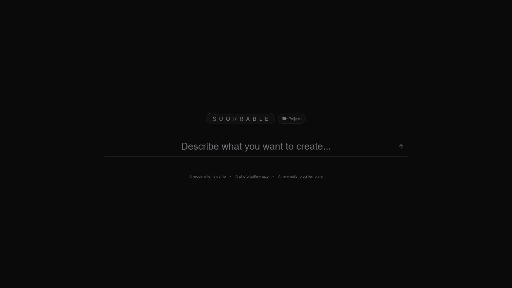
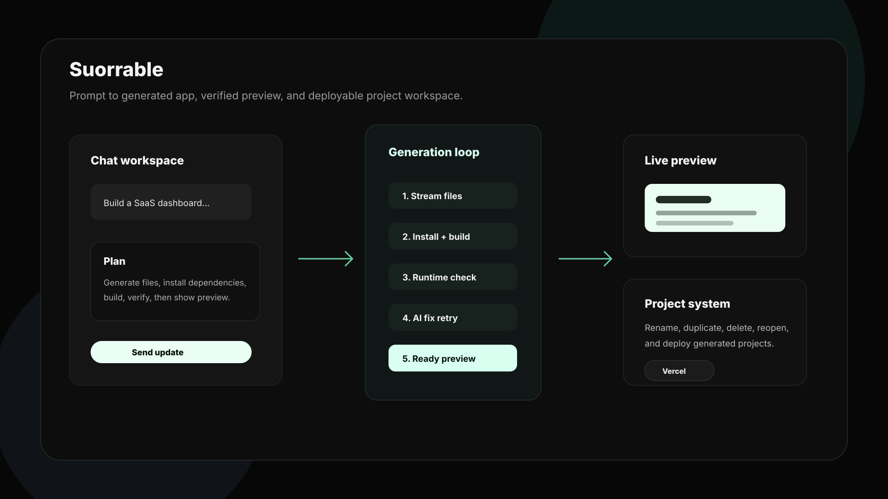
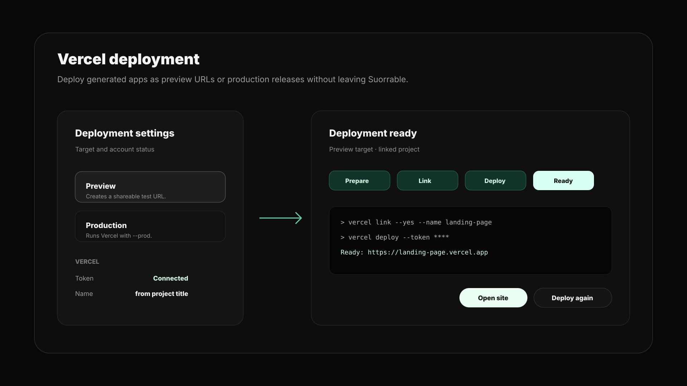
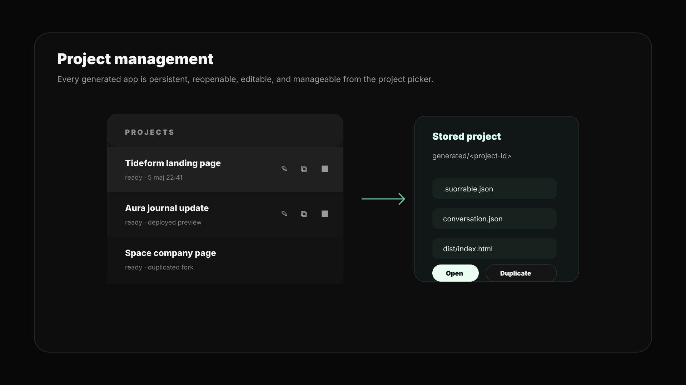

# Suorrable

Suorrable is an open-source Lovable-style AI app builder by Nils Persson Suorra. It takes a prompt, writes a complete Vite/React project, installs dependencies, builds it, verifies the preview, and can deploy the result to Vercel.

It is built as a local product prototype rather than a toy prompt wrapper: generated projects are persisted, editable, build-checked, fixable, manageable, and deployable.

## Preview


## What It Does

- Generates full Vite/React projects from natural language prompts.
- Streams planning, code generation, install, build, fix, and deploy progress.
- Stores each generated app in an isolated `generated/<project-id>` workspace.
- Lets you continue editing an existing generated project instead of rewriting everything.
- Automatically installs dependencies and runs production builds.
- Runs a local JSDOM runtime check before showing the preview.
- Attempts an AI-powered fix when generated code fails to build or verify.
- Keeps project history, metadata, and conversations.
- Supports rename, duplicate, and delete for generated projects.
- Deploys ready projects to Vercel with preview/production targets.
- Shows deploy settings, live Vercel logs, deployment status, and readable project names.
- Serves generated previews in a sandboxed iframe without `allow-same-origin`.

## Demo Flow

```text
Prompt
  -> Gemini code stream
  -> file parser
  -> isolated generated project
  -> npm install
  -> npm run build
  -> JSDOM runtime check
  -> live sandboxed preview
  -> optional Vercel deploy
```

Typical workflow:

1. Prompt Suorrable for an app or landing page.
2. Watch generation/build progress stream in the UI.
3. Preview the generated app.
4. Ask for changes; Suorrable sends focused project context and updates only changed files.
5. Rename, duplicate, delete, or reopen generated projects from the project picker.
6. Deploy to Vercel as preview or production.

Generated landing page example:



## Architecture



```text
client UI
  -> Express API
  -> Gemini generation/fix loop
  -> generated workspace
  -> install/build runner
  -> runtime verifier
  -> preview iframe
  -> Vercel deploy runner
```

Backend modules live in `src/server`:

- `app.js` wires API routes and SSE streams.
- `gemini.js` handles Gemini calls, chat history, and fix attempts.
- `generatedProject.js` parses `// FILE:` blocks, enforces build config, and collects edit context.
- `projectStore.js` owns project paths, metadata, conversations, duplication, deletion, and cleanup.
- `buildRunner.js` runs dependency install and production build commands.
- `runtimeCheck.js` verifies generated previews with JSDOM.
- `deployRunner.js` links and deploys generated apps to Vercel.
- `config.js` centralizes paths, environment variables, and timeouts.

Frontend modules:

- `main.ts` owns the main generation/editing flow.
- `deployUi.ts` owns deploy settings, logs, target selection, and draggable deploy status.
- `projectListUi.ts` renders project history and project actions.
- `chatUi.ts` owns markdown rendering, messages, build status, and log display.
- `previewControls.ts` owns preview sandbox enforcement and preview-control contrast hints.

## Safety Model

Suorrable is designed to reduce obvious local-generation risks:

- Generated file paths are validated so writes cannot escape the project folder.
- Generated previews run in an iframe without `allow-same-origin`.
- Preview runtime checks block non-local resource loading during JSDOM verification.
- Vercel tokens are read from `.env` and never shown in the UI.
- Deploy logs are token-redacted before being streamed to the browser.
- `.vercel`, `node_modules`, build output, and debug artifacts are excluded from AI edit context.

This is still a local developer tool, not a hardened multi-tenant sandbox.

## Setup

```bash
npm install
cp .env.example .env
npm run build
npm start
```

Then open:

```text
http://localhost:3000
```

For frontend development with Vite proxying API calls to the backend:

```bash
npm run dev
```

Run the backend separately:

```bash
npm start
```

## Environment

```text
GEMINI_API_KEY=your_gemini_api_key_here
GEMINI_MODEL=gemini-3-flash-preview
VERCEL_TOKEN=your_vercel_token_here
# Optional: VERCEL_SCOPE=your-team-or-user-slug
PORT=3000
```

## Vercel Deploy

Create a Vercel token, add it to `.env`, restart the backend, then click **Deploy** on any ready preview.


Suorrable supports:

- Preview deployments.
- Production deployments via `--prod`.
- Live Vercel CLI logs in the UI.
- Team/user targeting with `VERCEL_SCOPE`.
- Readable Vercel project names generated from the Suorrable project title or prompt.

```text
VERCEL_TOKEN=your_vercel_token_here
VERCEL_SCOPE=your-team-or-user-slug
```

When a generated project is not already linked, Suorrable runs `vercel link --yes --name <project-name>` before deployment. Already-linked projects keep their existing Vercel link to avoid accidentally creating a new Vercel project on every deploy.

Deployment metadata is stored in `.suorrable.json`, including deployment URL, target, status, scope, and deploy history.



## Project Management

Generated projects can be managed from the project picker:



- Rename a project for clearer history and Vercel naming.
- Duplicate a project to fork an idea.
- Delete projects you no longer need.
- Reopen previous conversations and previews.

Duplicating a project copies source/build artifacts but excludes `node_modules` and `.vercel`, then clears deployment metadata.

## Verification

Run syntax checks:

```bash
npm run check
```

Run tests:

```bash
npm test
```

Run the production frontend build:

```bash
npm run build
```

Current tests cover:

- Vercel deployment URL extraction.
- Vercel project name slug generation.
- Generated file parsing.
- Required generated-file validation.
- Planning tag removal.
- `.vercel` exclusion from AI context.
- Safe path resolution.

## Roadmap

- Add GitHub export so generated projects can be pushed to a new repository.
- Add Playwright-based visual QA for generated previews, including screenshot comparison and basic interaction checks.
- Add optional containerized builds for stronger isolation from the host machine.
- Add project templates for common app types such as SaaS dashboards, landing pages, blogs, and portfolios.
- Add provider abstraction so Gemini can be swapped for other model APIs.
